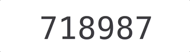
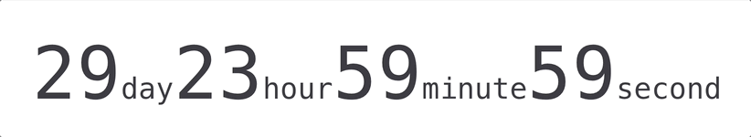

# timered-counter

Make the value change more vivid and natural.

<table>
<tr>
<th colspan="4">Timered Counter</th>
</tr>
<tr>
<td></td>
<td></td>
<td></td>
<td></td>
</tr>
<tr>
<td><a href="https://timered-counter.netlify.app/guide/examples/simple-usage.html#number"><strong>Simple</strong></a></td>
<td><a href="https://timered-counter.netlify.app/guide/examples/simple-usage.html#datetime-duration"><strong>Countdown</strong></a></td>
<td><a href="https://timered-counter.netlify.app/guide/examples/simple-usage.html#string"><strong>String</strong></a></td>
<td><a href="https://timered-counter.netlify.app/guide/examples/styled-usage.html#color"><strong>Colorful</strong></a></td>
</tr>
<tr>
<td></td>
<td></td>
<td></td>
</tr>
<tr>
<td><a href="https://timered-counter.netlify.app/guide/examples/locale-usage.html#locale-datetime-duration"><strong>Locale</strong></a></td>
<td><a href="https://timered-counter.netlify.app/guide/examples/animated-usage.html#delay"><strong>Delay</strong></a></td>
<td><a href="https://timered-counter.netlify.app/guide/examples/animated-usage.html#easing"><strong>Easing</strong></a></td>
</tr>
</table>

## Documentation

- [Online Documentation](https://timered-counter.netlify.app/)

## Thanks

> Thank JetBrains for providing an [open-source license](https://jb.gg/OpenSourceSupport), which allows me to use such an excellent IDE.

## License

